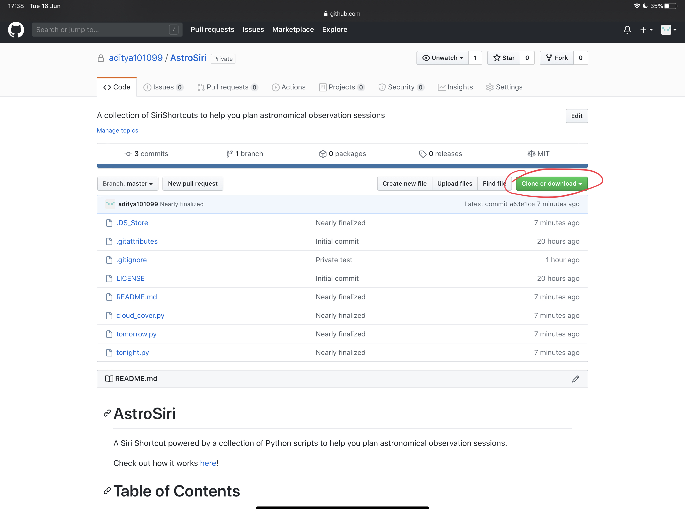
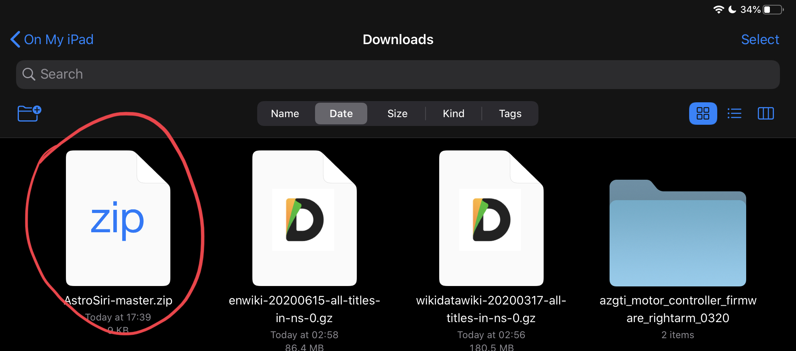
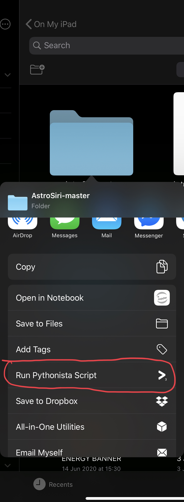
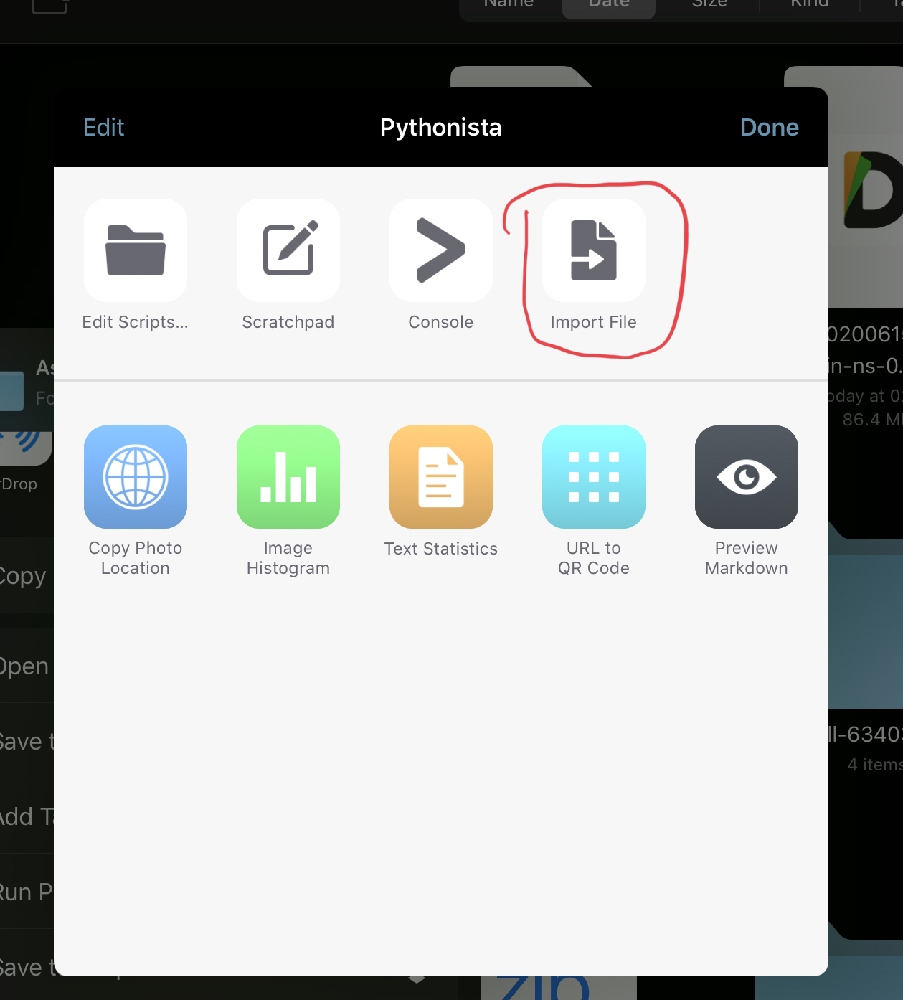

# AstroSiri

A Siri Shortcut powered by a collection of Python scripts to help you plan astronomical observation sessions.

Check out how it works [here](https://youtu.be/4us8ehGUh9w)!

# Table of Contents
* [Introduction](https://github.com/aditya101099/AstroSiri#introduction)
* [Installation](https://github.com/aditya101099/AstroSiri#installation)
* [Usage](https://github.com/aditya101099/AstroSiri#usage)
* [Technologies](https://github.com/aditya101099/AstroSiri#technologies)
* [Requirements](https://github.com/aditya101099/AstroSiri#requirements)
* [Status](https://github.com/aditya101099/AstroSiri#status)
* [Acknowledgements](https://github.com/aditya101099/AstroSiri#acknowledgements)

## Introduction

As an amateur astronomer, I am often at the mercy of the whims of nature when it comes to my ability to conduct astronomical observations or imaging sessions. The single most limiting factor of any astronomer's ability to gaze up at the heavens is the absence of clear skies. But equally important are the moon phase and presence - for too often a bright moon is a source of light pollution and limits how dark a sky can get. 

Hitherto, checking weather forecasts and moon phases require different services, and many clicks. I naturally turned to Siri to get the answers to my questions, but was disappointed by the lack of detail and accuracy in its responses. Therefore, I wanted a quick and easy way to supercharge my astronomical workflow with a simple voice command. 

What follows are a series of Python scripts which query the Dark Sky API and parse the results to tell you the following:

* Whether you can observe tonight
* Whether you can observe tomorrow
* Sunset and sunrise times for tonight and tomorrow morning, respectively
* Sunset and sunrise times for tomorrow night and the next morning, respectively
* What the cloud cover is like each hour between sunset and the following sunrise
* Moon phase and presence for today or tomorrow

These are then presented in a beautiful Siri Shortcuts front-end. See the [Usage](https://github.com/aditya101099/AstroSiri#usage) section to find out more.

This list will be continually updated as I find more things I want to know, or as a result of popular demand. If you would like a feature to be added, please let me know by opening an issue!

## Installation

In order to use this project, you **must** download and install [Pythonista](https://apps.apple.com/gb/app/pythonista-3/id1085978097) from the App Store. Pythonista has some special packages which are used in these scripts to make everything work. It is a cross-platform app so you can use this project on both iPhone and iPad. **NB. This project does not work on macOS, Windows, Linux, or Android.**

You must also be running iOS 13 or later. 

1. Get the [Siri Shortcut](https://www.icloud.com/shortcuts/e533e392192a4843a2345d65b697a890) that corresponds to this project and add it to your Shortcuts library. If you get an error saying the Shortcut cannot be imported, read through [this](https://9to5mac.com/2019/08/14/allow-untrusted-shortcuts-ios-13/).
2. On your iPad or iPhone, navigate to this GitHub page and download the folder as a zip file. 

3. Navigate to Files > Downloads and tap on the zip file to unzip it.

4. Long-press on the item to bring up the options menu and tap on the Share button. Select "Run Pythonista script" and Select "Import".

5. You're done! You are now ready to use AstroSiri!

## Usage

You can either use this shortcut by asking Siri "Let's talk about astronomy", or by going into the Shortcuts app and manually tapping on the Shortcut. Then, select the prompt that you're interested in (except the last one: "What are the observation results?"). Pythonista will automatically open and run the Python scripts and then open up Shortcuts again. To find out the answer to your question, you have to run the Shortcut again (either via Siri or by manually tapping on the Shortcut) and select the final option - "What are the observation results?". This double-invocation is due to limitations with Shortcuts in iOS and iPadOS.

The results of your query are also automatically copied to the clipboard, so you can paste them wherever you like. 

You can check out a video of it [here](https://youtu.be/4us8ehGUh9w)

## Technologies 

All weather data in sourced from the Dark Sky API, and all parsing is done using a series of Python libraries like urllib3 and json.  
Location fetching and clipboard access is possible due to Pythonista, which has special libraries that access various parts of iOS and iPadOS.

## Requirements

* iOS 13/iPadOS 13 or later
* [Siri Shortcuts app](https://apps.apple.com/gb/app/shortcuts/id1462947752)
* [Pythonista for iOS](https://apps.apple.com/gb/app/pythonista-3/id1085978097)
* ["Let's Talk About Astronomy Siri Shorcut"](https://www.icloud.com/shortcuts/e533e392192a4843a2345d65b697a890)

## Status

As of June 16, 2020, AstroSiri is completely functional. However, since it relies on the Dark Sky API - which will be shut down at the end of 2021 - AstroSiri may stop working unless another API is substituted in place of it. 

## Acknowledgements

AstroSiri cannot be possible without the [Dark Sky API](https://darksky.net/dev), as well as [Siri Shortcuts](https://support.apple.com/en-gb/HT209055) and [Pythonista](http://omz-software.com/pythonista/).
